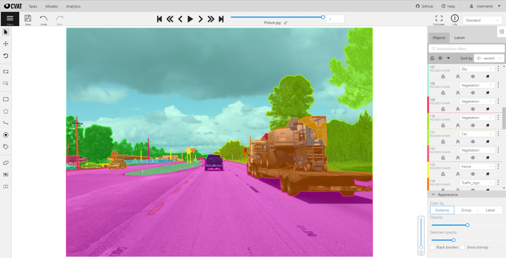

# 计算机视觉标注工具 (CVAT)

计算机视觉标注工具(CVAT)是基于 Web 为计算机视觉算法标注视频和图像的在线工具。

它的灵感来自[Vatic](http://carlvondrick.com/vatic/)免费的、在线的、交互式的视频注释工具。

CVAT有许多强大的功能:
- 在关键帧之间插入边界框
- 使用深度学习模型自动标注
- 大多数关键行动的捷径
- 带有注释任务列表的仪表板
- LDAP和基本授权
- 等……

它是为一个专业的数据注释团队创建和使用的。

特别针对我们团队开发的计算机视觉任务进行了用户体验和用户界面优化。

## 文档

- [安装指南](cvat/apps/documentation/installation.md)
- [用户手册](cvat/apps/documentation/user_guide.md)
- [Django REST API 文档](#rest-api)
- [Datumaro 数据集框架](datumaro/README.md)
- [命令行界面](utils/cli/)
- [XML 标注格式](cvat/apps/documentation/xml_format.md)
- [AWS 部署指南](cvat/apps/documentation/AWS-Deployment-Guide.md)
- [问题](#问题)

## Screencasts

- [Introduction](https://youtu.be/L9_IvUIHGwM)
- [Annotation mode](https://youtu.be/6h7HxGL6Ct4)
- [Interpolation mode](https://youtu.be/U3MYDhESHo4)
- [Attribute mode](https://youtu.be/UPNfWl8Egd8)
- [Segmentation mode](https://youtu.be/Fh8oKuSUIPs)
- [Tutorial for polygons](https://www.youtube.com/watch?v=XTwfXDh4clI)
- [Semi-automatic segmentation](https://www.youtube.com/watch?v=vnqXZ-Z-VTQ)

## Supported annotation formats

Format selection is possible after clicking on the Upload annotation
and Dump annotation buttons. [Datumaro](datumaro/README.md) dataset
framework allows additional dataset transformations
via its command line tool and Python library.

| Annotation format                                                                          | Import | Export |
| ------------------------------------------------------------------------------------------ | ------ | ------ |
| [CVAT for images](cvat/apps/documentation/xml_format.md#annotation)                        | X      | X      |
| [CVAT for a video](cvat/apps/documentation/xml_format.md#interpolation)                    | X      | X      |
| [Datumaro](datumaro/README.md)                                                             |        | X      |
| [PASCAL VOC](http://host.robots.ox.ac.uk/pascal/VOC/)                                      | X      | X      |
| Segmentation masks from [PASCAL VOC](http://host.robots.ox.ac.uk/pascal/VOC/)              | X      | X      |
| [YOLO](https://pjreddie.com/darknet/yolo/)                                                 | X      | X      |
| [MS COCO Object Detection](http://cocodataset.org/#format-data)                            | X      | X      |
| [TFrecord](https://www.tensorflow.org/tutorials/load_data/tf_records)                      | X      | X      |
| [MOT](https://motchallenge.net/)                                                           | X      | X      |
| [LabelMe 3.0](http://labelme.csail.mit.edu/Release3.0)                                     | X      | X      |

## Links
- [Intel AI blog: New Computer Vision Tool Accelerates Annotation of Digital Images and Video](https://www.intel.ai/introducing-cvat)
- [Intel Software: Computer Vision Annotation Tool: A Universal Approach to Data Annotation](https://software.intel.com/en-us/articles/computer-vision-annotation-tool-a-universal-approach-to-data-annotation)
- [VentureBeat: Intel open-sources CVAT, a toolkit for data labeling](https://venturebeat.com/2019/03/05/intel-open-sources-cvat-a-toolkit-for-data-labeling/)

## Online demo: [cvat.org](https://cvat.org)

This is an online demo with the latest version of the annotation tool.
Try it online without local installation. Only own or assigned tasks
are visible to users.

Disabled features:
- [Analytics: management and monitoring of data annotation team](/components/analytics/README.md)
- [Support for NVIDIA GPUs](/components/cuda/README.md)

Limitations:
- No more than 10 tasks per user
- Uploaded data is limited to 500Mb

## REST API

Automatically generated Swagger documentation for Django REST API is
available on ``<cvat_origin>/api/swagger``
(default: ``localhost:8080/api/swagger``).

Swagger documentation is visiable on allowed hostes, Update environement variable in docker-compose.yml file with cvat hosted machine IP or domain name.

Example - ``ALLOWED_HOSTS: 'localhost, 127.0.0.1'``)

## LICENSE

Code released under the [MIT License](https://opensource.org/licenses/MIT).

## 问题

CVAT usage related questions or unclear concepts can be posted in our
[Gitter chat](https://gitter.im/opencv-cvat) for **quick replies** from
contributors and other users.

However, if you have a feature request or a bug report that can reproduced,
feel free to open an issue (with steps to reproduce the bug if it's a bug
report) on [GitHub* issues](https://github.com/opencv/cvat/issues).

If you are not sure or just want to browse other users common questions,
[Gitter chat](https://gitter.im/opencv-cvat) is the way to go.

Other ways to ask questions and get our support:
* [\#cvat](https://stackoverflow.com/search?q=%23cvat) tag on StackOverflow*
* [Forum on Intel Developer Zone](https://software.intel.com/en-us/forums/computer-vision)
