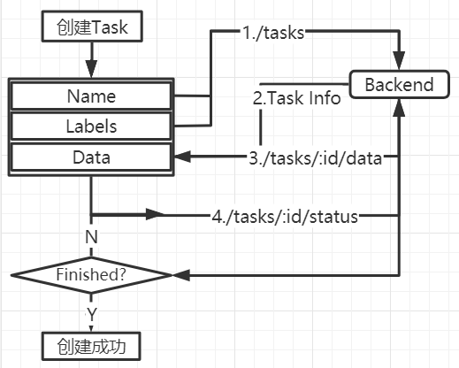

## 身份验证

### 登录

**Request URL**: http://alexking.site:8080/api/v1/auth/login

**Request Method**: POST

**Form Data**:

	username: ""
	password: ""

**Response**：Token Key

	{"key":"e7b5b0363cae7fe9c455636d6b21fc09f526aff0"}

### 注销

**Request URL**: http://alexking.site:8080/api/v1/auth/logout

**Request Method**: POST

### 注册

**Request URL**: http://alexking.site:8080/api/v1/auth/register

**Request Method**: POST

**Form Data**:

	{
	    "username":"",
	    "first_name":"",
	    "last_name":"",
	    "email":"",
	    "password1":"",
	    "password2":"",
	}

### 用户

返回当前已被授权的用户的实例信息。

**Request URL**: http://alexking.site:8080/api/v1/users/self

**Request Method**: GET

**Response**：

    {
        "url": "http://alexking.site:8080/api/v1/users/1",
        "id": 1,
        "username": "root",
        "first_name": "",
        "last_name": "",
        "email": "2426671397@qq.com",
        "groups": [
            "admin"
        ],
        "is_staff": true,
        "is_superuser": true,
        "is_active": true,
        "last_login": "2020-08-03T09:49:09.829369Z",
        "date_joined": "2020-08-03T09:49:00.616248Z"
    }

## 任务

### 创建任务

1. 上传 Task 基本信息

**Request URL**: http://alexking.site:8080/api/v1/tasks

**Request Method**: POST

**Request Data**：

    {
        "name":"testCreate",
        "labels":[
            {
                "name":"label1",
                "attributes":[
                    {
                        "name":"select",
                        "mutable":false,
                        "input_type":"select",
                        "default_value":"select",
                        "values":[
                            "select"
                        ]
                    }
                ]
            },
            {
                "name":"label2",
                "attributes":[
                    {
                        "name":"checkbox",
                        "mutable":false,
                        "input_type":"checkbox",
                        "default_value":"false",
                        "values":[
                            "false"
                        ]
                    }
                ]
            },
            {
                "name":"label3",
                "attributes":[
                    {
                        "name":"text",
                        "mutable":true,
                        "input_type":"text",
                        "default_value":"text",
                        "values":[
                            "text"
                        ]
                    }
                ]
            }
        ],
        "z_order":false
    }

**Response**：

    {
        "url":"http://alexking.site:8080/api/v1/tasks/4",
        "id":4,
        "name":"testCreate",
        "mode":"",
        "owner":3,
        "assignee":null,
        "bug_tracker":"",
        "created_date":"2020-08-05T14:14:44.636034+08:00",
        "updated_date":"2020-08-05T14:14:44.636090+08:00",
        "overlap":null,
        "segment_size":0,
        "z_order":false,
        "status":"annotation",
        "labels":[
            {
                "id":6,
                "name":"label1",
                "attributes":[
                    {
                        "id":6,
                        "name":"select",
                        "mutable":false,
                        "input_type":"select",
                        "default_value":"select",
                        "values":[
                            "select"
                        ]
                    }
                ]
            },
            {
                "id":7,
                "name":"label2",
                "attributes":[
                    {
                        "id":7,
                        "name":"checkbox",
                        "mutable":false,
                        "input_type":"checkbox",
                        "default_value":"false",
                        "values":[
                            "false"
                        ]
                    }
                ]
            },
            {
                "id":8,
                "name":"label3",
                "attributes":[
                    {
                        "id":8,
                        "name":"text",
                        "mutable":true,
                        "input_type":"text",
                        "default_value":"text",
                        "values":[
                            "text"
                        ]
                    }
                ]
            }
        ],
        "segments":[

        ],
        "project":null
    }

2. 上传 Task 数据集

**Request URL**: http://alexking.site:8080/api/v1/tasks/:id/data

**Request Method**: POST

**Response**：

    {
        "chunk_size":null,
        "size":0,
        "image_quality":70,
        "start_frame":0,
        "stop_frame":0,
        "frame_filter":"",
        "compressed_chunk_type":"imageset",
        "original_chunk_type":"imageset",
        "client_files":[
            "000000001296.jpg",
            "000000000776.jpg",
            "000000000285.jpg"
        ],
        "server_files":[

        ],
        "remote_files":[

        ],
        "use_zip_chunks":false
    }

3. 获取任务创建状态

**Request URL**: http://alexking.site:8080/api/v1/tasks/:id/status

**Request Method**: GET

**Response**：

    {"state":"Finished","message":""}

**Choices**:

    "Queued"：队列中
    "Started"：开始创建
    "Finished"：创建成功
    "Failed"：创建失败

### 任务列表

根据查询参数返回分页的任务列表（每页10个任务）

**Request URL**: http://alexking.site:8080/api/v1/tasks?page_size=10&page=1

**Request Method**: GET

**Response**：

    {
        "count": 2,
        "next": null,
        "previous": null,
        "results": [
            {
                "url": "http://alexking.site:8080/api/v1/tasks/2",
                "id": 2,
                "name": "test2",
                "mode": "annotation",
                "owner": 1,
                "assignee": null,
                "bug_tracker": "",
                "created_date": "2020-08-04T05:02:23.690371Z",
                "updated_date": "2020-08-04T05:02:23.690406Z",
                "overlap": 0,
                "segment_size": 0,
                "z_order": false,
                "status": "annotation",
                "labels": [
                    {
                        "id": 2,
                        "name": "name",
                        "attributes": [
                            {
                                "id": 2,
                                "name": "name",
                                "mutable": false,
                                "input_type": "select",
                                "default_value": "name",
                                "values": [
                                    "name"
                                ]
                            }
                        ]
                    }
                ],
                "segments": [
                    {
                        "start_frame": 0,
                        "stop_frame": 2,
                        "jobs": [
                            {
                                "url": "http://alexking.site:8080/api/v1/jobs/2",
                                "id": 2,
                                "assignee": null,
                                "status": "annotation"
                            }
                        ]
                    }
                ],
                "project": null,
                "data_chunk_size": 72,
                "data_compressed_chunk_type": "imageset",
                "data_original_chunk_type": "imageset",
                "size": 3,
                "image_quality": 70,
                "data": 2
            },
            {
                "url": "http://alexking.site:8080/api/v1/tasks/1",
                "id": 1,
                "name": "test",
                "mode": "annotation",
                "owner": 1,
                "assignee": null,
                "bug_tracker": "",
                "created_date": "2020-08-04T04:37:17.438341Z",
                "updated_date": "2020-08-04T04:37:17.438365Z",
                "overlap": 0,
                "segment_size": 0,
                "z_order": false,
                "status": "annotation",
                "labels": [
                    {
                        "id": 1,
                        "name": "test",
                        "attributes": [
                            {
                                "id": 1,
                                "name": "Name",
                                "mutable": false,
                                "input_type": "select",
                                "default_value": "Name",
                                "values": [
                                    "Name"
                                ]
                            }
                        ]
                    }
                ],
                "segments": [
                    {
                        "start_frame": 0,
                        "stop_frame": 2,
                        "jobs": [
                            {
                                "url": "http://alexking.site:8080/api/v1/jobs/1",
                                "id": 1,
                                "assignee": null,
                                "status": "annotation"
                            }
                        ]
                    }
                ],
                "project": null,
                "data_chunk_size": 72,
                "data_compressed_chunk_type": "imageset",
                "data_original_chunk_type": "imageset",
                "size": 3,
                "image_quality": 70,
                "data": 1
            }
        ]
    }
